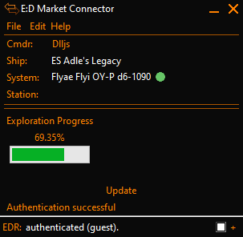

# Exploration Progress

A plugin for [ED Market Connector](https://github.com/EDCD/EDMarketConnector) and a simple Python program that allows [Elite Dangerous](https://www.elitedangerous.com/) explorer players to see their progress from one star system to another as a percentage. 

This was made while making a journey from Beagle Point back to the bubble after completing the [Distant Worlds 2](https://dw2expedition.wixsite.com/home) expedition. It took me quite a while to get back due to other commitments and increased boredom of jumping endlessly through the deep darkness of space. I wanted to see how far I was towards my destination in a simple way, not by plotting it on a map or watching a distance counter tick down, so I created this solution and shared it so other explorers can benefit from it.

## EDMC Plugin
This is a plugin for [ED Market Connector](https://github.com/EDCD/EDMarketConnector) that uses its many features to get real-time information on your CMDR's current location and display an auto updating progress indicator on the EDMC interface. The origin and destination system names are saved to your machine so you don't have to keep entering them every time.

**Please note:** Just like EDMC itself, this plugin only supports the PC & macOS versions of Elite Dangerous. Console (i.e. PS4 & Xbox One) versions are not supported.

### Images

### Requirements
* [EDMC](https://github.com/EDCD/EDMarketConnector) (v5.0.0+, may work on older versions)
* Internet connection (to connect to [EDSM](https://www.edsm.net/))

### How to Install
1. Get the [latest release](https://github.com/DlljsCodes/exploration-progress/releases/latest)
1. Extract the file
1. Copy the extracted folder into the EDMC plugin directory (you can find this by starting EDMC, going to File -> Settings, clicking on the "Plugins" tab and then clicking on the "Open" button)
1. Restart EDMC if already open

### How to Use
1. Run EDMC
1. Go to File -> Settings and click on the "Exploration Progress" tab
1. Enter the system you started at (Origin System)
1. Enter the system you are heading towards (Destination System)
1. Click "OK"
1. Log into Elite Dangerous or, if already in the game, make a hyperspace jump to find your current location
1. Your progress towards the destination system will be displayed as a percentage and on a progress bar, and will auto-update as you travel

Tip: If you get stuck, see the text in the Exploration Progress section of the EDMC window

## Standalone Program
Alternatively, you can use the original proof of concept standalone program, which is very simple. It unfortunately does not save your origin and destination systems and cannot automatically get your current system from the game. It also does not auto update, so you'll need to run the program and reenter information every time you want to get an update on your progress. As a result, _this standalone program may be depreciated in the future_.

### Requirements
* [Python](https://www.python.org/) 3.7
* Internet connection (to connect to [EDSM](https://www.edsm.net/))

### How to Use
1. Get the [latest release](https://github.com/DlljsCodes/exploration-progress/releases/latest)
1. Extract the file
1. Run standalone.py
1. Enter the system you started at (Origin System)
1. Enter the system you are heading towards (Destination System)
1. Enter the system your current system (Current System)
1. Your progress towards the destination system will be displayed as a percentage

## Credits

* Special thanks to all the EDMC (plugin) developers in the [EDCD Discord Server](https://discord.gg/zQjjutY). Without their help, the EDMC plugin would not exist.
* Thanks to [Marginal](https://github.com/Marginal) and [EDCD](https://github.com/EDCD) for the [EDMC](https://github.com/EDCD/EDMarketConnector) program.
* Thanks to [Anthor](https://github.com/EDSM-NET) for the [EDSM](https://www.edsm.net/) API.
* [Elite Dangerous](https://www.elitedangerous.com/) © 1984 - 2020 [Frontier Developments Plc.](https://www.frontier.co.uk/)

## Contact

* Twitter: [@dlljs](https://twitter.com/dlljs)
* Discord: Dlljs#8136
* Email: [contact@dlljs.uk](mailto:contact@dlljs.uk)